# 📈 학습 모델 추가 보고서(v1.1)

🔹 본 문서는 **SG → BG 예측 프로젝트의 고도화 이력 및 실험 결과를 정리**하기 위한 문서입니다.

🔹 추가된 모델, 앙상블 전략, 성능 변화 및 해석 결과를 체계적으로 기록합니다.

---

## 🧭 개요 (Overview)

🔹 초기 프로젝트는 **단일 회귀 모델 기반의 SG → BG 예측**을 목표로 설계되었습니다.  
    이후 모델 성능 및 일반화 능력 향상을 위해 다음과 같은 방향으로 점진적 고도화를 진행하였습니다.

- **Gradient Boosting 계열** 고성능 모델 도입
- 복수 모델 예측을 결합하는 **앙상블 전략 적용**

---

## 🔖 Version History

🔹 **v1.0 — Baseline Modeling(Initial Release)**

- 주요 모델
  - Linear Regression
  - Polynomial Regression
  - Huber Regressor
  - RandomForest Regressor
  - LightGBM Regressor

- 특징
  - SG 단일 변수 / SG + Meta 변수 실험 분리
  - Hold-out test 기반 성능 평가
  - 기본 시각화 (Actual vs Pred, Residual, Bland–Altman, CEGA)

---

🔹 **v1.1 — 학습 모델 추가(Gradient Boosting 기반 모델, Weighted Ensemble 도입)**

- 주요 변경 사항 (Key Changes)
  - **XGBoost Regressor, CatBoost Regressor** 추가
  - **Weighted Ensemble** 추가

- 도입 목적
  - 비선형성 및 변수 간 상호작용 학습 강화
  - 트리 기반 모델 간 성능 비교 가능성 확보

---

## 📊 시각화 분석 요약 – SG_ONLY_v1.1 실험 결과

🔹 **Figure 1. 모델 성능 비교 (R², RMSE, MAE, MARD)**

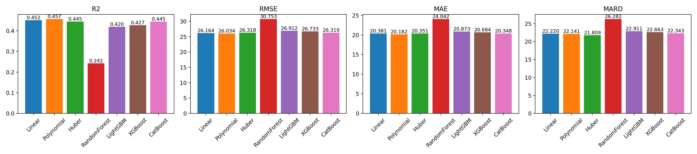

- **XGboost / CatBoost 모델**은 기존 Linear, Polynomial, Huber 모델과 유사하거나 약간 우수한 성능을 보였습니다.

---

🔹 **Figure 2. Actual vs Predicted BG**

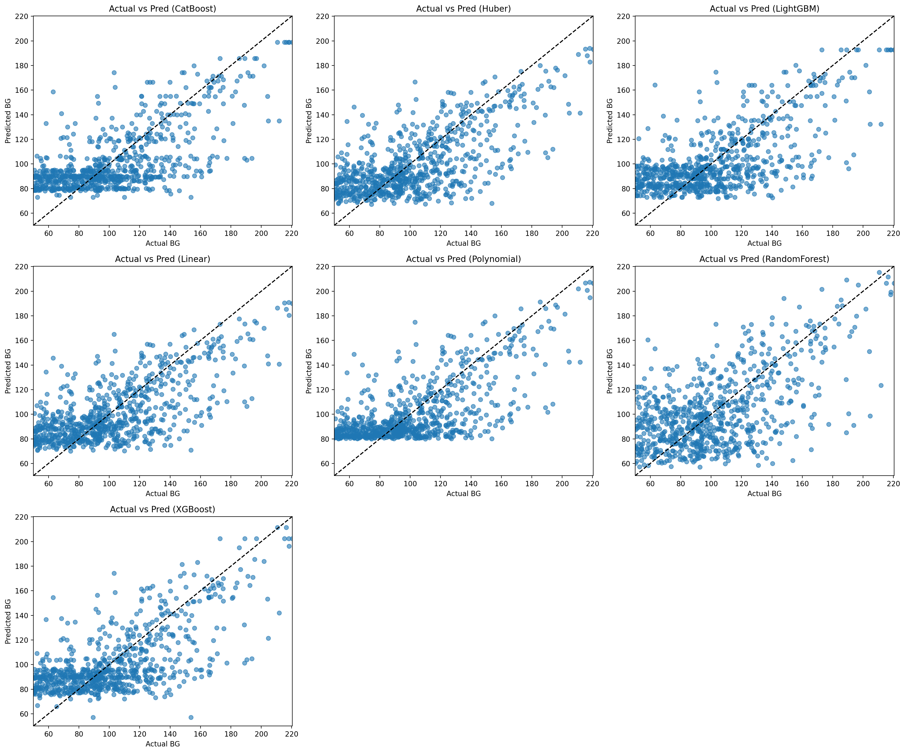

- **XGBoost / Catboost 모델**은 저혈당 구간에서는 예측이 비교적 안정적이나, 고혈당 영역에서는 과소추정 경향이 존재합니다.
- **LightGBM 모델**과 유사한 산점 분포 형태를 보입니다.

---

🔹 **Figure 3. Residual Analysis**

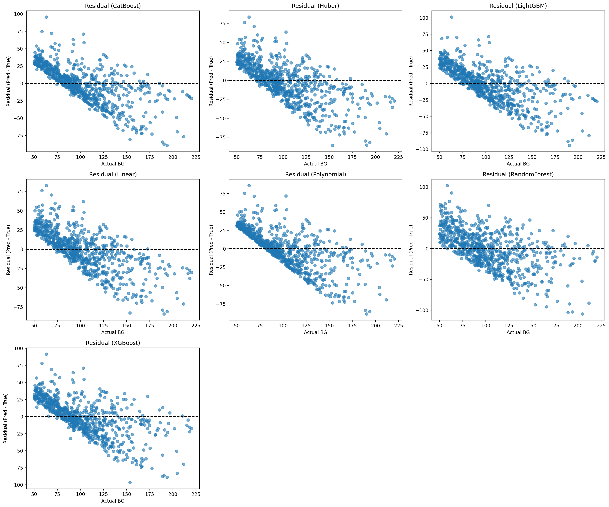

- **XGBoost / Catboost 모델**은 저혈당 구간에서 잔차가 상대적으로 안정적이나, 고혈당 구간에서는 음의 잔차 증가(과소 추정)로 나타납니다.

---

🔹 **Figure 4. Bland–Altman Analysis**

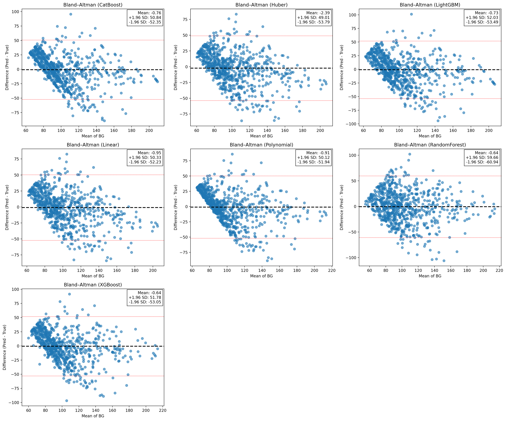

- **XGBoost / Catboost 모델**은 평균 `BG`가 증가할수록 음의 오차(과소추정) 경향 증가를 보입니다.
- 트리기반 모델이라 하더라도 입력정보가 단일변수일 경우 **이분산성**을 완전히 해소하기는 어렵습니다.
---

🔹 **Figure 5. Clarke Error Grid Analysis (CEGA)**

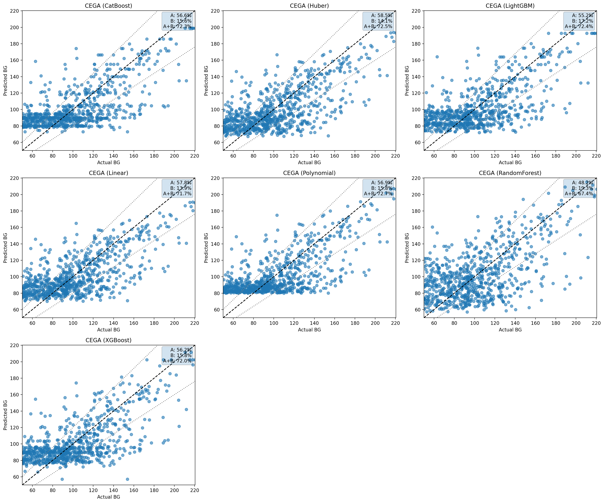

- **XGBoost / Catboost 모델**은 A+B Zone의 비율이 약 72%로 나타나며, 다른 모델들과 유사한 임상 안정성을 보입니다.
---

## ✅ SG_ONLY_v1.1 실험 요약

🔹**XGBoost / Catboost 모델**의 도입으로 기존 모델 대비 성능은 안정적이나, 단일 `SG` 입력 환경에서는 혁신적 개선은 제한적입니다.

---

## 📊 시각화 분석 요약 – SG_PLUS_META_v1.1 실험 결과

🔹 **Figure 1. 모델 성능 비교 (R², RMSE, MAE, MARD)**

- **CatBoost 모델**이 전체 모델 중 가장 높은 설명력을 가지며, 다른 지표들도 낮은 값을 나타냅니다.
- **XGBoost 모델과 Weighted Ensemble**도 높은 설명력을 가지며, 전반적으로 안정적인 상태를 보입니다.
 
---

🔹 **Figure 2. Actual vs Predicted BG**

- 비선형 상호작용을 직접 학습하는 모델인 **CatBoost**의 이점이 극대화 되어 고혈당 영역에서 과소예측 현상이 감소되었습니다.
- **Weighted Ensemble**은 극단값(Outlier)에 대한 예측이 완만하며, 단일 모델 대비 분산 축소 효과가 확인되었습니다.

---

🔹 **Figure 3. Residual Analysis**

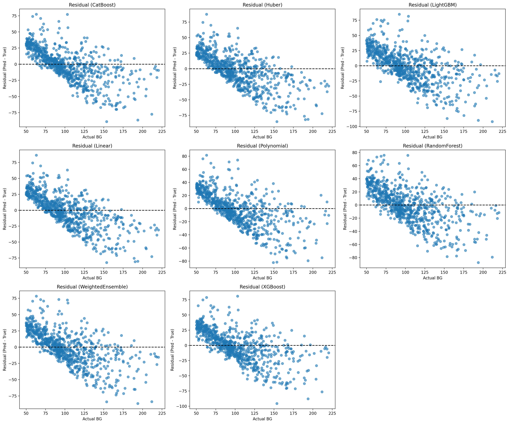

- **CatBoost모델**은 잔차 분포의 기울기가 완화되었으며, 고혈당 영역에서 체계적인 음의 편향 감소하였습니다.
- **Weighted Ensemble**은 극단적 잔차 발생 빈도가 감소, 평균적인 안정성을 확보하였습니다.

---

🔹 **Figure 4. Bland–Altman Analysis**

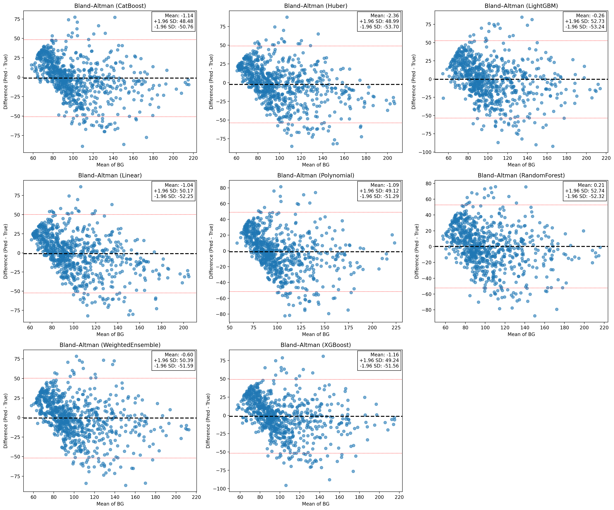

- **CatBoost모델**은 LoA폭이 SG_ONLY 대비 명확히 감소하였습니다.
---

🔹 **Figure 5. Clarke Error Grid Analysis (CEGA)**

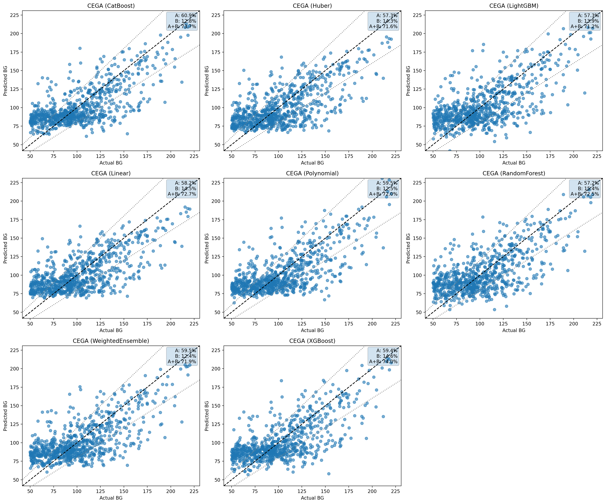

- **CatBoost모델**에서 A+B Zone 비율이 약 73%를 나타냈으며, 임상 안전 영역 비율이 전반적으로 상승하였습니다.
---

## ✅ SG_PLUS_META_v1.1 실험 요약

🔹**CatBoost 단일 모델**이 최적으로 보이며, 이는 범주형/비선형 상호작용을 내부적으로 잘 활용한 결과로 해석됩니다.

---

## 🧠 설명가능성(Explainability) 분석 결과(SG_PLUS_META_v1.1 실험)

🔹 **Figure 1. LIME Local Explanation – CatBoost**

- `SG`가 해당 샘플에서 `BG`예측을 가장 크게 증가시키는 요인으로 나타납니다.
- `BMI_Class_Overweight` 변수는 예측값을 추가적으로 상승시키는 방향으로 작용됩니다.

---

🔹 **Figure 2. SHAP Summary Plot – CatBoost**

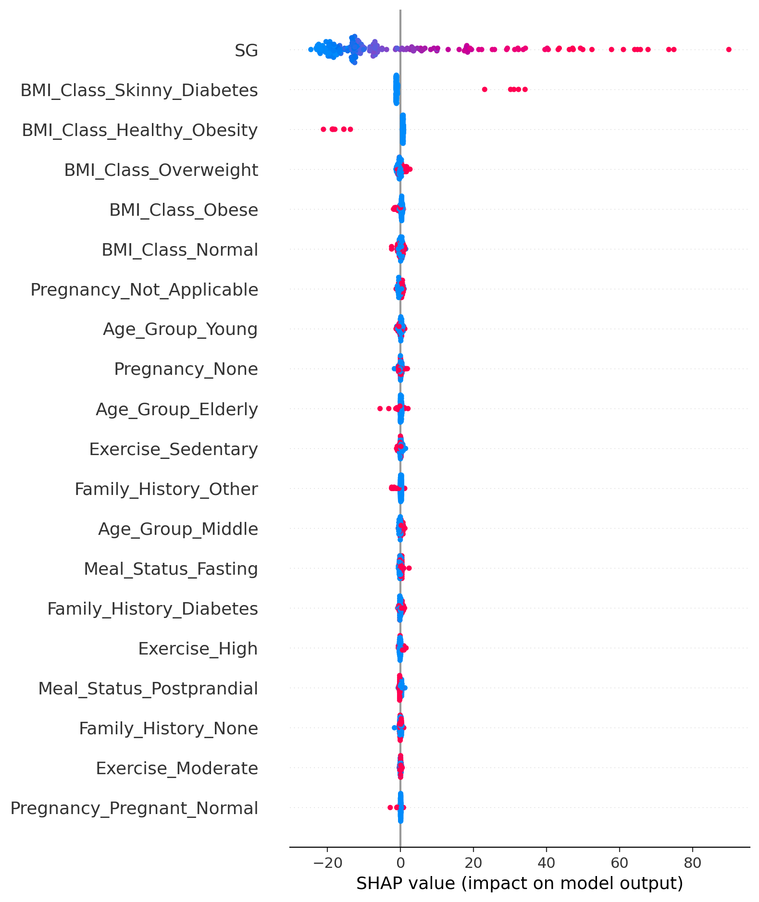

- `SG`가 가장 압도적인 영향력을 가지는 변수이며, `BG`를 강하게 증가시키는 방향으로 작용하고 있습니다.
- `BMI_Class` 변수가 상위 변수로 등장, 동일한 `SG`값이라도 BMI에 따라 `BG`예측 보정이 발생함을 보여줍니다.

---

🔹 **Figure 3. LIME Local Explanation – XGBoost**

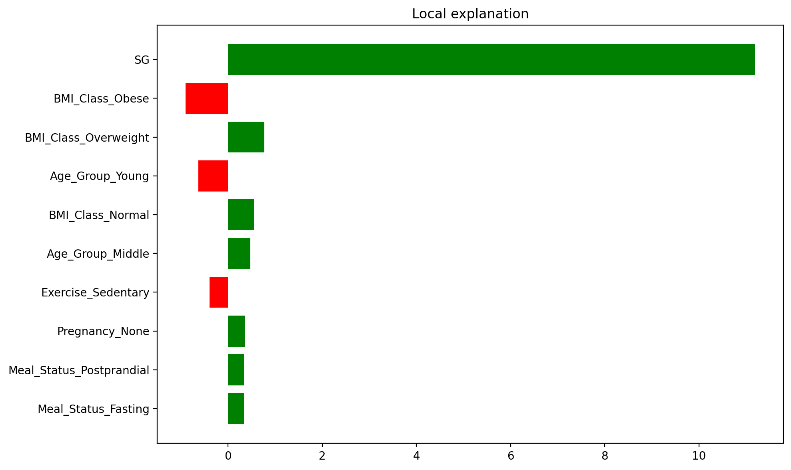

- `SG`가 해당 샘플에서 `BG`예측을 가장 크게 증가시키는 요인으로 나타납니다.

---

🔹 **Figure 4. SHAP Summary Plot – XGBoost**

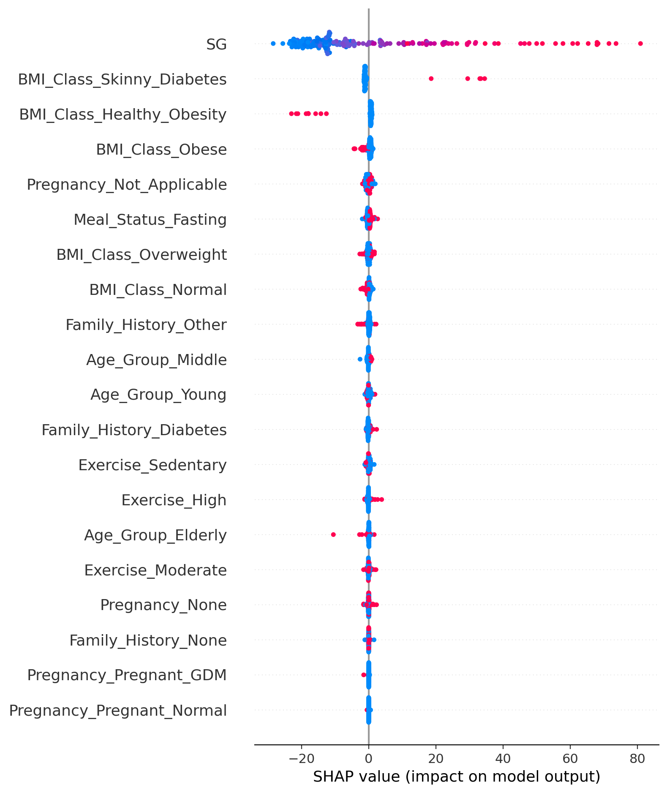

- `SG`가 가장 압도적인 영향력을 가지는 변수이며, `BG`를 강하게 증가시키는 방향으로 작용하고 있습니다.
- `BMI_Class` 변수 및 일부 변수들을 이용해 세밀한 보정을 수행하는 구조로 학습되어 있습니다.

---

### ✅ 설명가능성 분석 종합 요약
 
🔹**CatBoost 모델**은 XGBoost 모델 대비 설명가능성이 높고 안정적인 변수 기여 구조를 보여 **임상 해석 및 보고 목적**에 더 적합한 모델로 판단됩니다.

---
## 📈 교차검증 기반 성능 평가 (K-Fold Validation)

🔹 **K-Fold 평균 성능 요약 (SG_PLUS_META)**

| Model         | R² ↑   | RMSE ↓ | MAE ↓ | MARD ↓ | CEGA A (%) ↑ | CEGA A+B (%) ↑ |
|--------------|--------|--------|--------|--------|--------------|----------------|
| Polynomial   | 0.4614 | 26.07  | 20.37  | 22.79  | 55.47        | 78.65          |
| CatBoost     | 0.4505 | 26.34  | 20.62  | 23.07  | 54.87        | 78.65          |
| Linear       | 0.4502 | 26.34  | 20.57  | 22.93  | 54.48        | 78.65          |
| Huber        | 0.4473 | 26.42  | 20.48  | 22.44  | 53.31        | 78.26          |
| XGBoost      | 0.4237 | 26.97  | 21.14  | 23.58  | 53.31        | 78.57          |
| LightGBM     | 0.4218 | 27.02  | 21.25  | 23.77  | 52.37        | 78.52          |
| RandomForest | 0.1914 | 31.95  | 25.21  | 27.76  | 44.32        | 74.43          |

🔹 **K-Fold 결과 해석**

- **CatBoost모델**은 XGBoost 대비 더 높은 R²와 낮은 RMSE/MARD를 보이며, 임상 지표(CEGA A 비율, Bland–Altman bias)에서도 가장 안정적인 성능을 나타냈습니다.

---

## ✨ 결론

🔹 메타 정보를 포함한 트리기반 **Gradient Boosting 모델**이 가장 실용적인 성능과 해석 균형을 보였습니다.
