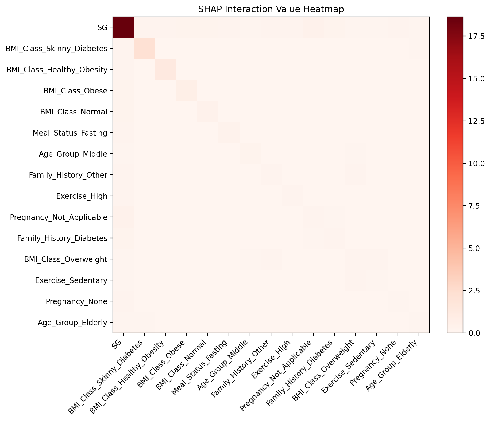
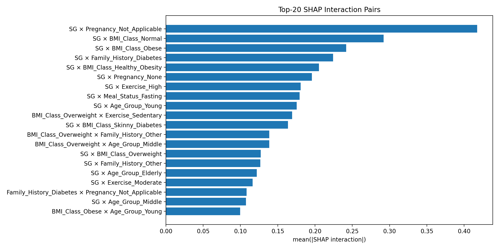

# 📌 SHAP Interaction Value 기반 변수 상호작용 분석 보고서(v1.2)

🔹 본 문서는 **SG → BG 예측 프로젝트의 고도화 이력 및 실험 결과를 정리**하기 위한 문서입니다.

🔹 **SHAP Interaction Value 기반 변수 상호작용 분석** 해석 결과를 체계적으로 기록합니다.

---

## 🔖 Version History

🔹 **v1.0 — Baseline Modeling(Initial Release)**

🔹 **v1.1 — 학습 모델 추가(Gradient Boosting 기반 모델, Weighted Ensemble 도입)**

🔹 **v1.2 — Explainability 고도화 (SHAP Interaction Value 분석 도입)**

- 주요 변경 사항 (Key Changes)
  - **SHAP Interaction Value 기반 변수 간 상호작용 분석 도입**
  - 단일 Feature 중요도 분석에서 확장하여, **Feature Pair 수준의 비선형 상호작용 구조 해석**
  - SHAP Interaction Heatmap 및 Interaction Pair 시각화 추가

- 분석 대상 모델: **XGBoost Regressor 단일 모델**

---

## 🧭 개요 (Overview)

🔹 v1.2에서는 기존 단일 변수 중요도 중심의 설명가능성 분석을 확장하여, **변수 간 상호작용(Interaction)** 이 예측 결과에 미치는 영향을 정량적으로 분석하기 위해 **SHAP Interaction Value 분석**을 도입하였습니다.

🔹 **어떤 변수 조합이 함께 작용할 때 BG 예측에 의미 있는 비선형 영향을 만드는가**를 해석하는 것을 목표로 합니다.

---

## ✅ SHAP Interaction Value 개념 설명

🔹 SHAP Interaction Value는 모델이 예측을 할 때 **변수 하나하나의 영향**뿐 아니라, **두 변수가 함께 작용하면서 만들어내는 추가적인 영향**까지 수치로 표현하는 기법입니다.

> “이 변수 하나만 바뀌었을 때 영향은 얼마인가?”,  
> “이 변수와 다른 변수가 동시에 특정 상태일 때, 영향이 얼마나 더 커지거나 작아지는가?”를 함께 보여주는 지표입니다.

🔹 SHAP Interaction Value를 통해 단순히 “어떤 변수가 중요한가?”를 넘어서 **어떤 조건에서, 어떤 변수 조합이 BG 예측을 크게 변화시키는지**를 구조적으로 이해할 수 있습니다.

🔹 이는 임상적 해석 관점에서 **같은 수치라도 환자 상태에 따라 결과가 달라질 수 있다**는 점을 정량적으로 설명해주는 중요한 근거가 됩니다.

---

## ✅ 분석 대상 모델 선정

🔹 본 버전의 SHAP Interaction 분석은 **XGBoost 모델 단일 대상으로 수행**하였습니다.

🔹 XGBoost 모델 선정 이유

- SHAP Interaction Value는 **Tree 기반 모델 중에서도 내부 트리 구조 접근이 가능한 모델**에서만 안정적으로 계산 가능
- 실험 결과:
  - **XGBoost**: `TreeExplainer.shap_interaction_values()` 안정적 계산 가능
  - **CatBoost**: SHAP Interaction 계산 시 내부 TreeEnsemble 구조 호환성 문제 발생
  - **LightGBM / Linear 계열**: SHAP Interaction 공식 지원 또는 안정성 부족

🔹 따라서 v1.2에서는 **해석 신뢰성과 재현성 확보를 위해 XGBoost 단일 모델로 한정**하여 분석을 진행하였습니다.

---

## 🖼️ 시각화 결과 분석

🔹 **Figure 1. Shap Interaction Heatmap 분석**

🔹 위의 히트맵은 XGBoost 모델에 대해 계산된 **SHAP Interaction Value**를 시각화한 결과입니다. 각 셀은 두 변수 조합이 BG 예측에 미치는 **상호작용 강도**를 의미하며, 색이 진할수록 영향이 큽니다.

🔹 히트맵의 **대각선(SG × SG)** 위치에서 가장 강한 값이 관찰되었으며, 이는 `SG`가 `BG` 예측에 있어 **단일 변수로서 가장 지배적인 Main Effect**를 가진다는 점을 의미합니다.

🔹 `BG` 예측에서 **보조 변수 단독 혹은 보조 변수 간 조합의 영향은 제한적**이며 대부분의 설명력은 **SG 중심 + 보조 변수에 의한 조정 효과**로 구성됩니다.

> 모델은 단순 선형 조합이 아닌 **SG x 환자상태 형태의 비선형 상호작용 구조**를 학습하고 있으며, 이는 XGBoost 모델이 **임상적 맥락을 반영한 합리적인 예측 구조**를 형성하고 있음을 보여줍니다. 

---

🔹 **Figure 2. Shap Interaction Heatmap 분석**

🔹 위 그래프는 XGBoost 모델에서 계산된 SHAP Interaction Value 중 **평균 절댓값 기준 상위 20개 변수 쌍**을 시각화한 결과입니다. **막대가 길수록 두 변수의 조합이 BG 예측에 미치는 상호작용 효과가 크다**는 것을 의미합니다.

🔹 상위 20개 상호작용 쌍 대부분이 **SG를 포함한 조합**으로 나타났으며, 다음 조합들이 가장 높은 상호작용 값을 보였습니다.

- `SG × Pregnancy_Not_Applicable`
- `SG × BMI_Class_Normal`
- `SG × BMI_Class_Obese`
- `SG × Family_History_Diabetes`
- `SG × BMI_Class_Healthy_Obesity`

🔹 `BG`예측은 **SG 단일 효과 + SG와 변수 간 상호작용**으로 설명 가능하며, XGBoost 모델은 환자 상태에 따라 `SG`의 영향력을 조절하고 있습니다.

🔹 이는 단순 회귀 모델 대비 **임상적 맥락을 반영한 비선형 의사결정 구조**를 형성하고 있음을 의미합니다.

---

## ✅ 종합 해석

🔹 SHAP Interaction Heatmap과 SHAP Interaction Pair 시각화를 종합하면, XGBoost 모델의 `BG` 예측 구조는 **SG 단일 효과 중심 구조에 임상적 맥락 변수들이 상호작용 형태로 결합된 구조**임을 알 수 있습니다.

🔹 **SG의 지배적인 Main Effect**

  - Interaction Heatmap의 대각선 성분에서 `SG`**가 가장 높은 값을 보이며**, 이는 `BG` 예측에서 `SG`가 **가장 핵심적인 단일 변수(Main effect)** 임을 의미합니다.
  - 다른 변수들의 대각선 값은 상대적으로 매우 작아 BMI, 연령, 운동, 가족력 등의 변수는 **단독으로는 제한적인 설명력**을 가지며, `SG`의 효과를 보정하는 역할에 가깝습니다.

🔹 **SG x 변수 상호작용의 구조적 중요성**

- `SG`와 `Pregnancy`, `BMI`, `Family_History`, `Age_Group` 변수들 간의 상호작용이 `BG` 예측에서 중요한 역할을 수행함이 확인되었습니다.
- 특히 `SG × Pregnancy_Not_Applicable`, `SG × BMI_Class_Normal / Obese` 조합은 상호작용 강도가 가장 높아, **동일한 SG 값이라도 환자의 생리적·대사적 상태에 따라 BG 반응이 크게 달라질 수 있음**을 보여줍니다.

🔹 **비 SG 변수 간  상호작용의 보조적 역할**

- 비 `SG` 변수 간 상호작용도 일부 존재하지만 그 크기는 `SG`를 포함한 상호작용에 비해 상대적으로 작으며, 이는 `BG` 예측에서 핵심 구조가 **SG 중심 + 상태 변수 조합 구조**임을 보여주고 있습니다.

---

## ✨ 결론

- SHAP Interaction 분석 결과, XGBoost 모델은 다음과 같은 특성을 가집니다.
  - `BG` 예측의 중심은 `SG`**의 강한 단일 효과**
  - 그러나 실제 예측은 `SG`**와 임상 변수 간 상호작용을 통해 정교화**
  - 환자 상태를 반영한 **임상적으로 해석 가능한 비선형 모델 구조** 형성
- 이는 단순 회귀 기반 모델 대비 XGBoost가 혈당 예측 문제에서 **설명력과 임상적 타당성을 동시에 확보**하고 있음을 의미합니다.
- SHAP Interaction 분석은 다음과 같은 한계가 있으며, 본 결과는 `BG` **예측에서 중요한 변수 조합과 경향성을 이해하기 위한 탐색적 분석 결과**로 해석하는 것이 타당합니다.
  - SHAP Interaction Value는 **모델이 학습한 패턴을 설명**하는 지표로 변수 간의 **인과 관계(causality)를 의미하지는 않습니다.**
  - 분석 결과는 `SG`**를 중심으로 한 변수 상호작용 구조**를 잘 보여주지만, `SG` 이외 변수 간 상호작용은 상대적으로 작아 모든 임상 변수 조합의 영향을 충분히 설명하지는 못합니다.
  - SHAP Interaction Value는 계산 비용이 매우 높아 전체 데이터가 아닌 **샘플링된 데이터 기반 결과**로 해석되어야 합니다.