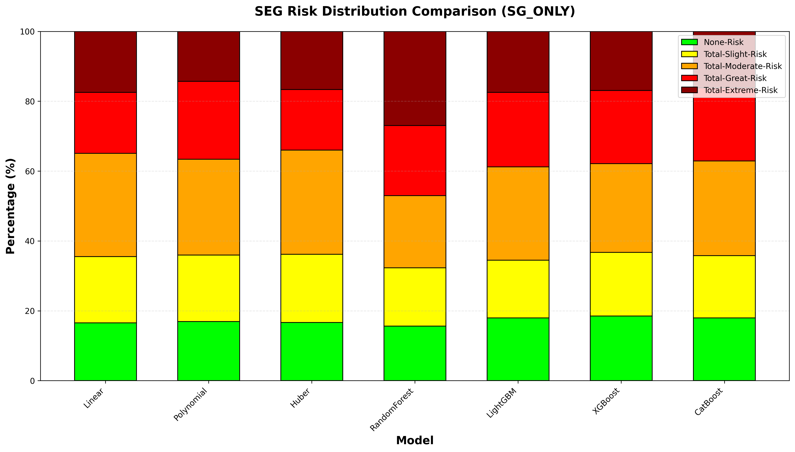
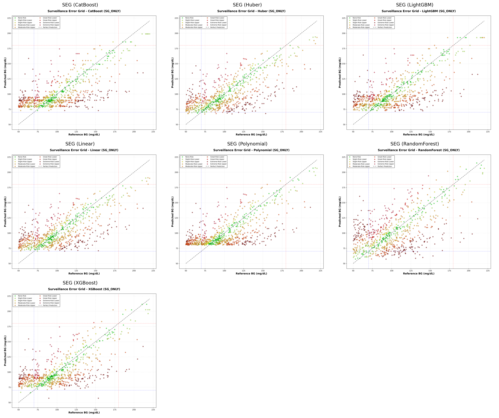
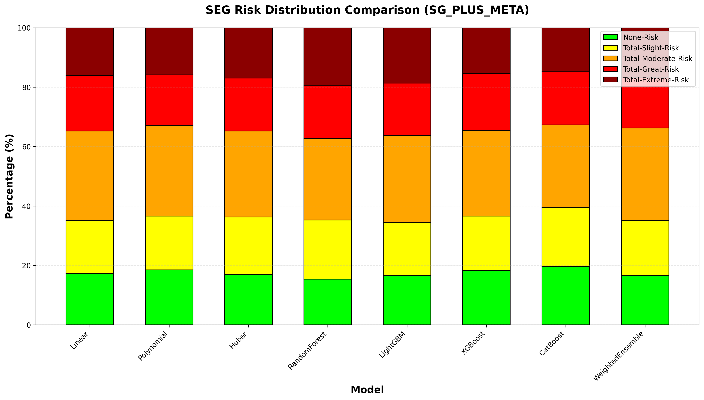
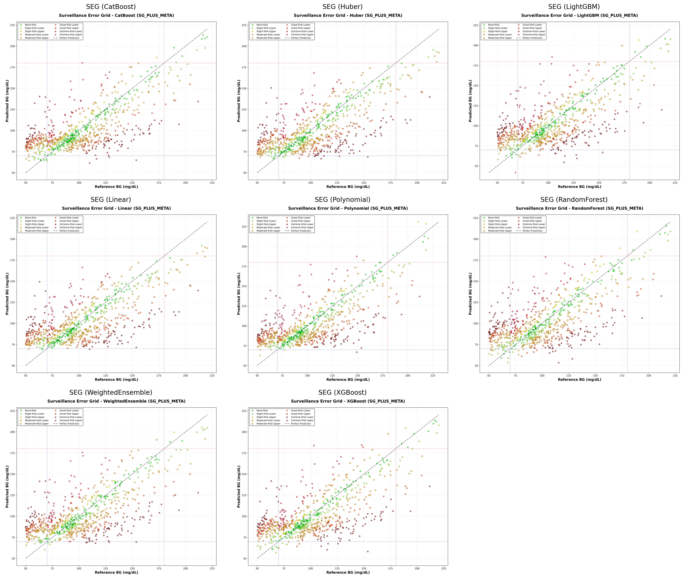

# 📌 SEG Analysis 보고서(v1.3)

🔹 본 문서는 **SG → BG 예측 프로젝트의 고도화 이력 및 실험 결과를 정리**하기 위한 문서입니다.

🔹 **Surveillance Error Grid(SEG)** 기반 임상적 위험도 분석 해석 결과를 체계적으로 기록합니다.

---

## 🔖 Version History

🔹 **v1.0 — Baseline Modeling(Initial Release)**

🔹 **v1.1 — 학습 모델 추가(Gradient Boosting 기반 모델, Weighted Ensemble 도입)**

🔹 **v1.2 — Explainability 고도화 (SHAP Interaction Value 분석 도입)**

🔹 **v1.3 — Clinical Safety 고도화(SEG Risk Analysis 도입)**

- 주요 변경 사항 (Key Changes)
  - **SEG(Surveillance Error Grid)기반** 임상 위험도 평가 모듈 추가
  - 단순 성능지표(MARD, RMSE)를 넘어 **예측 오차의 임상적 위험 수준을 정량화**
  - 모델별 **SEG Zone 분포 비교 및 위험도 시각화 추가**

---

## 🧭 개요 (Overview)

🔹 v1.3에서는 기존의 회귀 성능 평가를 확장하여 모델 예측이 단순히 "정확한가"를 넘어 **임상적으로 안전한가?, 치료 판단에 위험을 유발하지 않는가?** 를 평가하기 위해 **SEG 기반 위험도 분석을 도입**하였습니다.

🔹 목표는 다음과 같습니다.

 - 모델별 예측 오차가 어느 Risk Zone에 속하는지 정량화
 - SG_ONLY 대비 SG_PLUS_META에서 임상 안정성이 향상되는지 검증
 - Extreme/Greate Risk를 최소화하는 모델을 최종 후보로 선정

---

## ✅ SEG(Surveillance Error Grid) 개념 설명

🔹 SEG는 혈당 예측 분야에서 넓게 사용되는 임상적 평가 기준으로, 단순 오차 크기가 아니라 **그 오차가 환자 치료에 미치는 위험 수준(Clinical Risk)** 을 Zone으로 구분합니다.

> “예측이 10mg/dL 틀렸다면 단순 오류인가?”,  
> “그 오류가 인슐린 처치를 잘못 유도하는 위험인가?”를 위험도 수준으로 분류하는 지표입니다.

🔹 SEG Risk Zone 정의

| Zone | 의미 | 임상적 해석 |
|------|------|-------------|
| **None-Risk** | 거의 위험 없음 | 안전한 예측 |
| **Slight-Risk** | 경미한 위험 | 추가 모니터링 수준 |
| **Moderate-Risk** | 중간 위험 | 치료 판단 영향 가능 |
| **Great-Risk** | 큰 위험 | 잘못된 처치 위험 |
| **Extreme-Risk** | 매우 위험 | 치명적 처치 오류 가능 |

🔹 SEG 분석 시 확인 필요한 내용은 다음과 같습니다.

 - None + Slight 비율 증가  
 - Great + Extreme 비율 최소화

---

## ✅ 분석 대상 실험 구성

🔹 본 SEG 분석은 두 가지 Feature 실험을 비교합니다.

- **Experiment 1. SG_ONLY**
  - 가장 기본 예측 구조에서 임상 위험 분포 확인
- **Experiment 2. SG_PLUS_META**
  - Meta 정보 추가 시 SEG 위험도가 감소하는지 확인

---

## 🖼️ 시각화 결과 분석

## 🔹 Figure 1. SEG Risk Distribution Comparison (SG_ONLY)

🔹 위 그래프는 **SG_ONLY 실험**에서 모델별 예측 결과가 각 Risk Zone(None~Extreme)에 얼마나 분포하는지(%)를 비교한 결과입니다.

🔹 **RandomForest는 Extreme-Risk 비율이 가장 크게 나타나** SG_ONLY 환경에서 **임상적으로 가장 위험한 모델로 판단**됩니다.

🔹 **Boosting 계열(LightGBM/XGBoost/CatBoost)** 은 RandomForest 대비 Extreme 구역 비중이 낮으며 **상대적으로 안정적**입니다.

🔹 **선형 계열(Linear/Huber)** 은 Extreme 사고는 적지만 **Moderate-Risk 영역이 지속적으로 존재하는 구조**입니다.

---

## 🔹 Figure 2. SEG Scatter Plot Comparison (SG_ONLY)

🔹 각 모델별 Reference BG(x축) vs Predicted BG(y축) scatter이며 점의 색은 SEG Risk Zone을 의미합니다.

🔹 **해석방법**은 다음과 같습니다.

- 대각선(y=x)에 가까울수록 안전한 예측(None/Slight)
- 대각선에서 멀어질수록 Great/Extreme risk 발생
- 위험 점이 특정 BG 구간에 집중되면 Bias 패턴 존재 가능 

🔹 **RandomForest**는 붉은 점이 넓게 퍼져 있어 **특정 구간에서 큰 임상적 오차를 유발하는 패턴이 관찰**됩니다.

🔹 **Boosting 계열**은 초록 점이 대각선 주변에 더 밀집하며 **위험 점이 비교적 제한적**으로 나타납니다.

---

## 🔹 Figure 3. SEG Risk Distribution Comparison (SG_PLUS_META)

🔹 SG_PLUS_META 실험에서는 **Meta Feature 추가 이후 Extreme Risk가 전체적으로 감소하며 모델 간 안정성이 개선**되었습니다.

🔹 SG_ONLY 대비 **Extreme Risk가 더 균일하고 낮아지는 경향**을 보입니다.

🔹 **CatBoost / XGBoost**는 None+Slight 비율이 가장 높으며, **임상적으로 가장 안전한 후보 모델로 판단**됩니다.

🔹 **WeightedEnsemble**은 MARD 개선 가능성은 있으나, **SEG Risk 측면에서 Extreme 감소 효과는 제한적**입니다.

---

## 🔹 Figure 4. SEG Scatter Plot Comparison (SG_PLUS_META)

🔹 Meta 정보가 포함되면서 **대각선 주변 초록 점 집중도가 증가, Great/Extreme 점 분산이 줄어드는 임상 안전성이 강화된 구조**가 관찰됩니다.

---

## ✅ 종합 해석

🔹 SG_PLUS_META는 **임상 안정성을 향상**시킵니다.

 - SG_ONLY에서는 RandomForest 중심으로 Extreme 사고가 크게 발생, **Meta Feature 추가 이후 Extreme Risk가 감소하며 안정성 증가**

🔹 임상적으로 가장 안정적인 모델 후보는 **CatBoost, XGBoost모델**이며 **None/Slight 비율이 높고 Extreme이 상대적으로 낮습니다.**

---

## ✨ 결론

🔹 SEG 분석은 단순 성능지표를 넘어 **예측 오차의 임상적 위험도를 평가할 수 있는 핵심 안전성 척도**입니다.

🔹 SG_PLUS_META 실험은 Extreme 사고를 줄이며 **임상적으로 더 안전한 예측 구조를 형성**합니다.

🔹 최종적으로 **CatBoost/XGBoost 계열이 SG → BG 예측에서 가장 높은 임상적 타당성과 안정성을 확보한 모델로 판단** 됩니다.

🔹 SEG는 임상 위험도를 정량화하지만 **인과 관계(causality)를 의미하지는 않으므로 해석 시 주의가 필요**합니다.