# 📘 SG 기반 BG 예측 프로젝트

🔹 본 프로젝트는 **타액 포도당**(`SG, Salivary Glucose`), **여러 생리·생활 카테고리   변수**를 활용하여 **혈당**(`BG, Blood Glucose`)을 **예측**하는 머신러닝 파이프라인 입니다.

🔹 본 프로젝트는 **학습 / 추론 / 설명가능성**의 세 가지 파이프라인으로 분리되어 설계되었습니다.

---

## 🧠 프로젝트 개요

🔹 **입력 변수**
- `SG(Salivary Glucose)`
- 범주형 변수: `Meal_Status`, `BMI_Class`, `Age_Group`, `Exercise`, `Family_History`, `Pregnancy`

🔹 **출력 변수**
- `BG(Blood Glucose)`

🔹 **주요 목표**
- `SG` 기반 `BG` 예측 가능성 검증
- 머신러닝 모델 성능 비교
- 임상적 관점의 평가
- SHAP / LIME 기반 설명가능성 확보

---

## 📊 데이터 구성

🔹 수치형 + 범주형 혼합 데이터 4,000개

🔹 타깃 변수: `BG`

🔹 모든 파이프라인에서 동일한 데이터 schema 사용

---

## 🧹 데이터 전처리 및 선택 근거

🔹 **결측치 처리**
- 범주형 변수의 결측치는 `Not_Applicable`로 대체
- 데이터 손실 최소화 및 추론 안정성 확보 목적

🔹 **잔차 기반 이상치 제거**
- SG–BG 간의 기본적인 관계를 포착하기 위해 **1차 선형 회귀 모델**을 기준선(baseline)으로 설정
- **잔차**가 큰 비정상 샘플 제거

🔹 **Isolation Forest**
- `SG`와 `BG`를 동시에 고려하는 **다변량 관점**의 이상치 추가 제거

---

## 🧩 Feature 구성 전략

🔹 **학습 / 추론 파이프라인**
- 범주형 변수 → **Ordinal Encoding (정수 인코딩)**
- 목적: 모델 안정성, CLI / Streamlit 일관성 확보

🔹 **설명가능성 파이프라인 (SHAP / LIME)**
- 범주형 변수 → **One-Hot Encoding**
- 목적: **서브 카테고리 단위 해석 가능**

> 📌 학습/추론과 설명가능성 파이프라인을 분리하여 **성능 안정성과 해석 정밀도를 동시에 확보**하였습니다.

---

## 🤖 사용한 머신러닝 모델

🔹 Linear Regression

🔹 Polynomial Regression (degree=3)

🔹 Huber Regression

🔹 Random Forest Regressor

🔹 LightGBM Regressor

---

## 📏 평가지표

🔹 **정량 지표**
- R², RMSE, MAE, MARD

🔹 **시각·임상 지표**
- Residual Plot, Bland–Altman Plot, CEGA (Clarke Error Grid Analysis)

---

## 📁 프로젝트 구조

```text
sg_bg_project/
├── main.py                         # 전체 학습 파이프라인 실행 진입점
│
├── pipelines/
│   ├── pipeline.py                 # 학습 파이프라인 (전처리 → 학습 → 평가 → 시각화)
│   └── explain_pipeline.py         # 설명가능성 파이프라인 (SHAP / LIME)
│
├── src/
│   ├── preprocessing.py            # 데이터 전처리 및 이상치 제거
│   ├── feature_builder.py          # Feature 생성 및 인코딩 로직
│   ├── models.py                   # 머신러닝 모델 정의 및 학습
│   ├── evaluation.py               # 성능 평가 지표 계산 (R², RMSE, MAE, MARD)
│   ├── visualization.py            # 기본 시각화 생성 (산점도, residual 등)
│   ├── explainability.py           # SHAP / LIME 설명가능성 분석
│   └── logger.py                   # 프로젝트 전반에서 공통으로 사용하는 Logger 설정 모듈 (실행 흐름 추적 및 디버깅 목적)
│
├── inference/
│   ├── cli_predict.py              # CLI 기반 BG 추론 실행 스크립트
│   └── inference_model.py          # 저장된 모델 로드 및 추론 로직
│
├── app/
│   └── interactive_app.py          # Streamlit 기반 인터랙티브 대시보드
│
├── tools/
│   └── merge_metrics_bar.py        # 평가지표 bar plot 병합 시각화
│
├── results/
│   ├── SG_ONLY/                    # SG 단일 변수 실험 결과
│   └── SG_PLUS_META/               # SG + 메타 변수 실험 결과
│
├── docs/
│   └── figures/                    # README용 Figure 이미지
│
├── Dockerfile                      # Docker 이미지 정의
├── .dockerignore                   # Docker 빌드 제외 파일 목록
├── requirements.txt                # Python 의존성 목록
├── README.md                       # 프로젝트 메인 설명 문서
├── README_DOCKER.md                # Docker 실행 가이드
└── System_Architecture.md          # 전체 시스템 아키텍처 개념 문서
```

---

## 📊 데이터 분포 분석 (공통)

### 🔹 Figure 1. SG vs BG Scatter

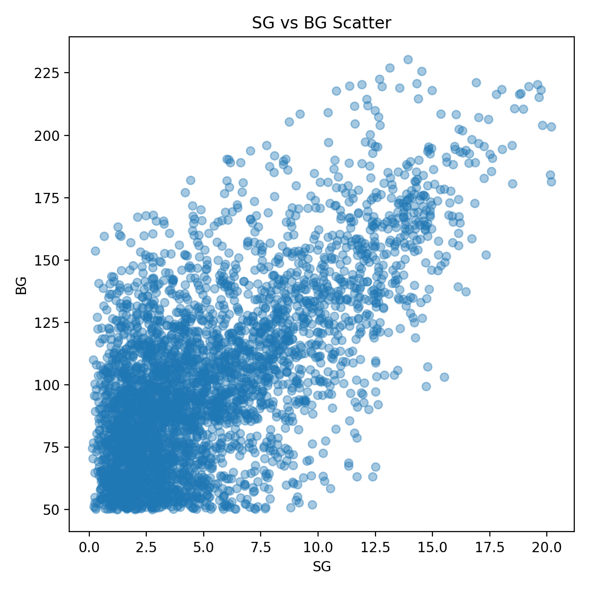

- 본 시각화는 원본 데이터에서의 `SG`와 `BG` 관계를 나타냅니다.
- 두 실험(SG_ONLY, SG_PLUS_META)은 동일한 데이터 분포를 기반으로 수행되었습니다.
- 이후 실험 간 차이는 **입력 변수 구성에 따른 예측 성능 및 상대 오차(MARD)차이**에 있습니다.

---

## 📊 시각화 분석 요약 – SG_ONLY 실험 결과

🔹SG_ONLY 실험은 **타액 포도당**(`SG`) 단일 변수만을 사용하여 **혈당**(`BG`)을 예측한 기준 실험으로,`SG`자체의 설명력과 모델 구조적 한계를 확인하기 위한 목적의 실험입니다.

---

### 🔹 Figure 1. 모델 성능 비교 (R², RMSE, MAE, MARD)

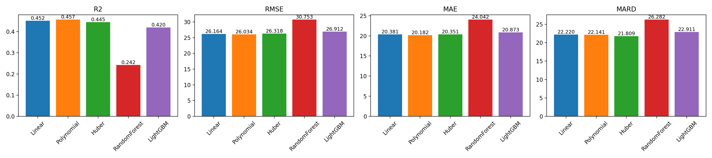

- **선형(Linear), 다항(Polynomial), Huber 모델**은 전반적으로 **유사한 성능 수준**을 보였습니다.
- **RandomForest 모델**은 비선형 패턴을 일부 포착하였으나, **R² 감소와 함께 RMSE·MAE·MARD가 모두 증가**하여 예측 안정성은 낮았습니다.
- **LightGBM 모델**은 상대적으로 균형 잡힌 성능을 보였으나, **MARD가 약 23%수준으로 유지되어 SG 단일 변수 기반의 임상적 한계**가 명확합니다.
- `SG`는 `BG`예측에 의미있는 정보를 제공하지만, **단일 변수**만으로는 **BG의 복잡한 변동성과 개인 간 차이를 충분히 설명하기 어렵습니다.**

---

### 🔹 Figure 2. Actual vs Predicted BG (All Models)


- 대부분의 모델이 저혈당 및 정상 혈당 영역에서는 **비교적 안정적인 예측**을 보입니다.
- 고혈당 구간으로 갈수록 **과소 예측 경향**이 모든 모델에서 공통적으로 관찰됩니다.
- 이는 고혈당 영역에서 **상대 오차(MARD)가 증가하는 구조적 원인**으로 작용합니다.
- `SG`단일 변수는 `BG`의 전반적인 증가 추세는 반영할 수 있으나, 고혈당 영역에서 나타나는 **비선형적, 개인차적 변동성을 충분히 설명하기에는 정보가 제한적**임을 보여줍니다.

---

### 🔹 Figure 3. Residual Analysis

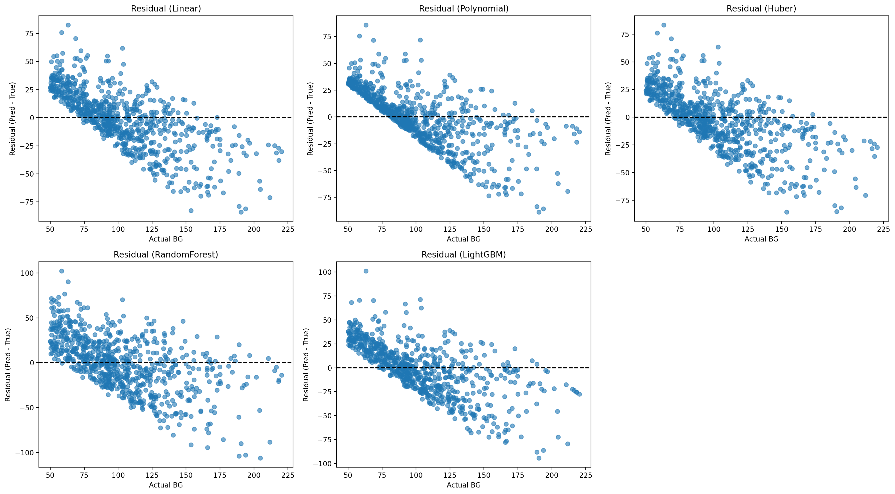

- 대부분의 모델이 `BG` 값이 증가할수록 잔차가 **음의 방향으로 편향**되는 패턴이 나타납니다.
- 이는 고혈당 영역에서의 **체계적인 과소 추정 및 MARD 증가**를 시사합니다.


---

### 🔹 Figure 4. Bland–Altman Analysis

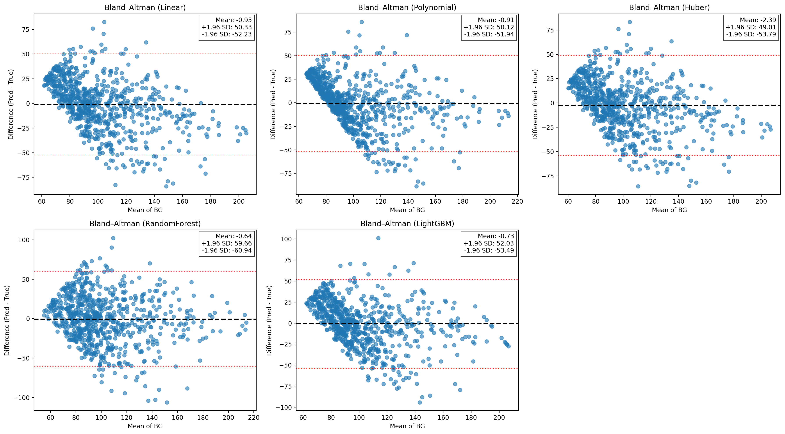

- 대부분의 모델이 평균 `BG` 증가에 따라 오차 분산이 커지는 **이분산성(heteroscedasticity)** 이 확인되며, Mean of BG 값이 증가할수록 **과소 예측 경향**이 관찰됩니다.
- SG_ONLY 모델은 **BG 범위 전반에서 일관된 상대 오차(MARD)를 유지하기 어려움**을 보여줍니다.

---

### 🔹 Figure 5. Clarke Error Grid Analysis (CEGA)

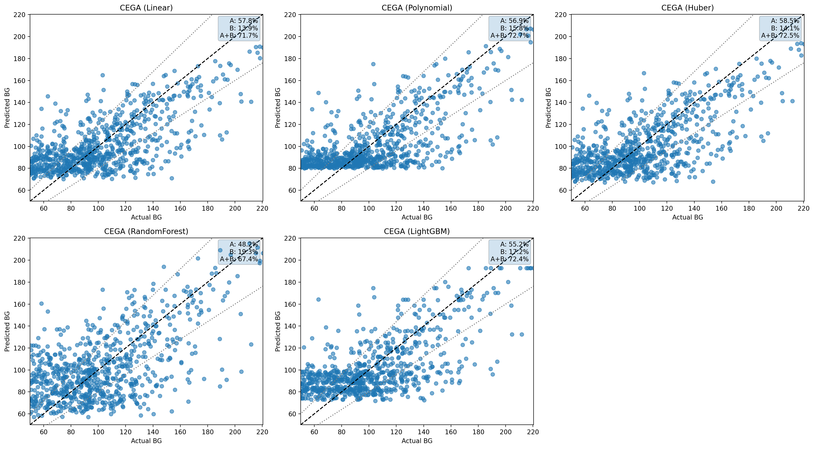

- 대부분의 모델의 A+B zone 비율은 약 **70% 수준**으로 나타났습니다.
- 고혈당 구간에서는 A+B zone을 벗어나는 점이 증가하여 **고혈당 과소예측 경향이 반영된 결과**를 보여주고 있습니다.
- 이는 기본적인 경향성은 포착하지만 **임상적 활용을 위해서는 추가적인 변수 정보가 필요함**을 시사합니다.

---

### ✅ SG_ONLY 실험 요약

> 📌`SG`는 `BG`예측에 **의미 있는 신호를 제공**하지만, **단일 변수만으로는 상대 오차(MARD)를 충분히 낮추기 어려워 임상적 수준의 정확도를 달성하기 어렵습니다.**

🔹본 실험 결과는 **추가적인 생리·생활 변수(SG_PLUS_META)를 포함한 확장 모델의 필요성**을 보여주며, 이후 실험에서는 **다변량 입력을 통한 성능 개선을 중점적으로 분석**합니다.

---

## 📊 시각화 분석 요약 – SG_PLUS_META 실험 결과

🔹SG_PLUS_META 실험은 **타액 포도당**(`SG`) 에 더해 `Meal_Status`, `BMI_Class`, `Age_Group`, `Exercise`, `Family_History`, `Pregnancy` 등의 **생리·생활 변수**를 함께 사용하여 **혈당**(`BG`) **예측 성능 향상을 평가**한 확장 실험입니다.

🔹본 실험의 목적은 `SG`**단일 변수의 한계를 보완**하고, **메타데이터가 예측 정확도와 임상적 신뢰성에 미치는 영향을 분석**하는 것입니다.

---

### 🔹 Figure 1. 모델 성능 비교 (R², RMSE, MAE, MARD)

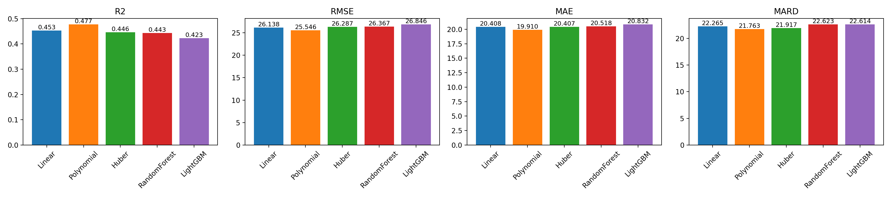

- **선형(Linear), 다항(Polynomial), Huber 모델, LightGBM 모델**은 전반적으로 SG_ONLY 실험 결과와  **유사한 수준**을 보였습니다.
- **RandomForest 모델**은 SG_ONLY 실험 결과보다 **모든 항목이 개선된 것**으로 확인되었습니다.
- 메타데이터 추가를 통해 **모델 설명력이 증가**하고 **전반적인 안정성**이 향상되었습니다.

---

### 🔹 Figure 2. Actual vs Predicted BG (All Models)

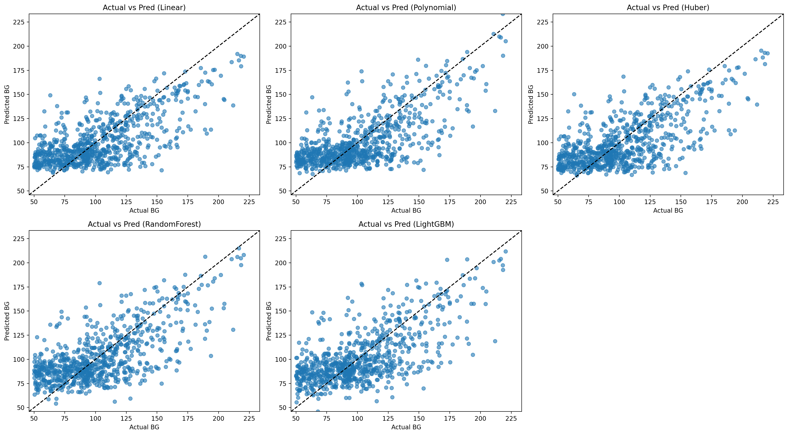

- SG_ONLY 실험 대비 **대각선(y = x) 주변의 점 밀도가 증가**하여 예측 정합도가 개선되었습니다.
- 특히 중·고혈당 영역에서 일부 모델(Polynomial, LightGBM)의 과소 예측 현상이 완화되며, **상대 오차(MARD) 감소로 이어지는 분포 변화**가 확인됩니다.
- 다만, 고혈당 영역에서는 여전히 분산이 존재하여 **추가적인 설명 변수 또는 모델 구조 개선의 필요성**이 남아 있습니다.

---

### 🔹 Figure 3. Residual Analysis

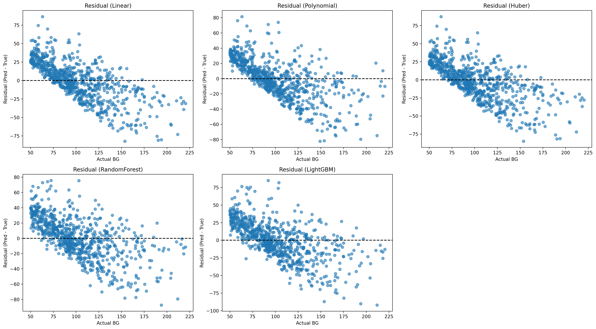

- `BG`증가에 따른 **음의 잔차 경향**은 여전히 관찰되나, SG_ONLY 대비 **잔차 분산이 전반적으로 감소**하였습니다.
- 이는 메타데이터가 **BG 수준에 따른 체계적인 오차를 일부 보정**했음을 의미합니다.
- Polynomial 및 Huber 모델에서 잔차 구조가 비교적 안정적으로 나타납니다.

---

### 🔹 Figure 4. Bland–Altman Analysis

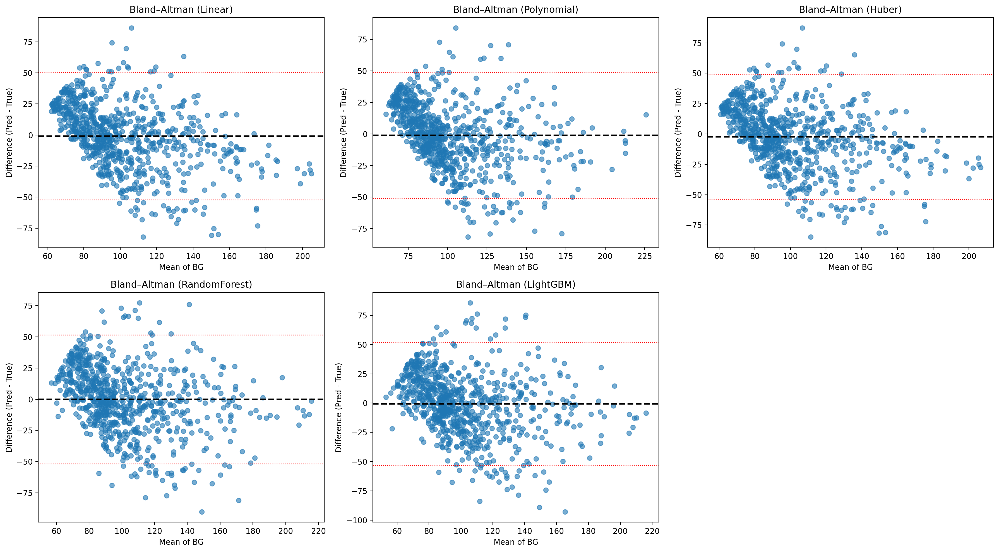

- 평균 오차(mean bias)는 대부분 0 근처에 위치하여 **체계적인 편향은 크지 않음**을 확인할 수 있습니다.
- SG_ONLY 대비 **±1.96 SD 범위 내 분포가 다소 수렴**하며 예측 일관성이 개선되었습니다.
- 고혈당 영역에서 일부 모델(RandomForest)은 여전히 분산이 크지만, **전반적인 이분산성은 완화**되었습니다.

---

### 🔹 Figure 5. Clarke Error Grid Analysis (CEGA)

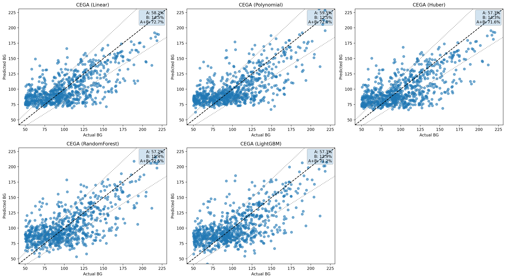

- A+B zone 비율은 약 **72~74% 수준**으로 SG_ONLY 대비 소폭 향상되었습니다.
- A zone 비율 증가를 통해 **임상적으로 허용 가능한 예측 비율이 개선**되었음을 확인할 수 있습니다.
- Polynomial 및 LightGBM 모델이 비교적 안정적인 해석 결과를 보였습니다.

---

### ✅ SG_PLUS_META 실험 요약

> 📌**메타데이터를 추가**함으로써 `SG` 단일 입력 모델의 구조적 한계를 완화하고, **전반적인 예측 정확도와 임상적 신뢰도를 개선**할 수 있었습니다.

🔹본 실험 결과는 `SG`기반 `BG`예측에서 **생리·생활 변수의 결합이 필수적임**을 보여주며, 향후에는 **추가 생체 신호** 또는 **시계열 정보 결합**을 통해 **고혈당 영역 예측 성능 개선을 목표**로 할 수 있습니다.

---

## 🧠 설명가능성(Explainability) 분석 결과

🔹본 프로젝트에서는 **SG_PLUS_META 실험**을 기반으로 모델 예측 결과에 대한 해석 가능성을 확보하기 위해 **SHAP(Global explanation)**, **LIME(Local explanation)** 분석을 수행하였습니다.

🔹설명가능성 분석은 예측 성능과 분리된 전용 파이프라인에서 수행되며, 특히 **서브 카테고리 단위(feature level)** 영향 해석에 중점을 두었습니다.

---

### 🔹 Figure 1. LIME Local Explanation – LightGBM

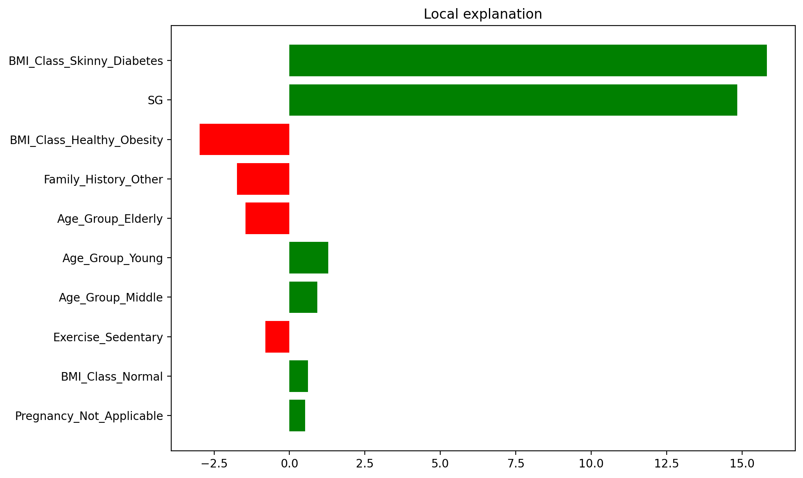

- 개별 샘플에 대한 **국소적(Local) 예측 설명 결과**입니다.
- `BMI_Class_Skinny_Diabetes` 특성을 가진 경우 `BG`가 **더 높게 예측되도록 모델이 조정**하고 있음을 의미합니다.
- `SG` 가 **양의 기여도**를 가지며, 해당 샘플의 `BG`예측값을 **증가시키는 핵심 요인으로 작용**합니다.
- `BMI_Class`, `Age_Group`, `Family_History` 등 **메타 변수들이 보조적인 조정 역할**을 수행하고 있음을 확인할 수 있습니다.
- 이는 LightGBM이 `SG` **중심 + 메타 변수 보정 구조로 예측을 수행**함을 의미합니다.

---

### 🔹 Figure 2. SHAP Summary Plot – LightGBM

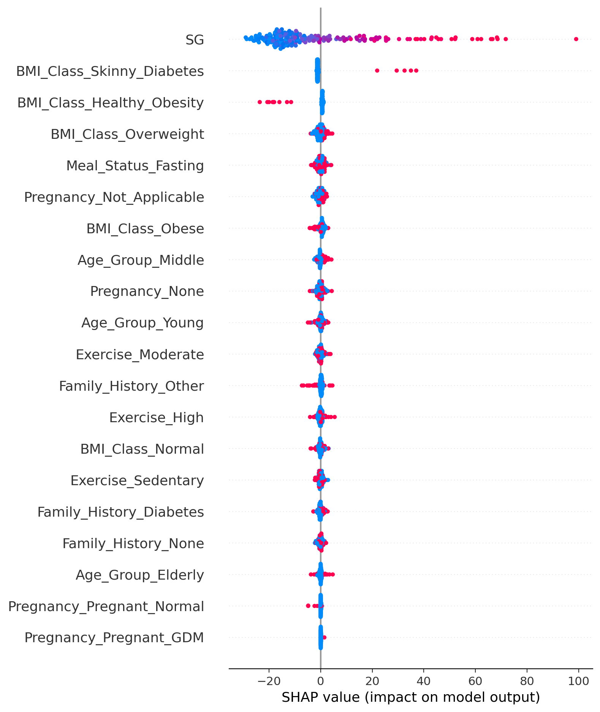

- 전체 데이터셋 기준 **전역(Global) 특성 중요도 분석 결과**입니다.
- SHAP value 분포를 통해 `SG`가 **가장 지배적인 영향 변수**임이 명확히 나타납니다.
- `BMI_Class`, `Age`, `Meal_Status`, `Exercise` 등 메타 변수들은 **특정 구간에서만 비선형적 영향**을 미치는 형태로 관찰됩니다.
- 이는 LightGBM이 `SG`를 1차 결정 변수로 사용한 뒤, **개인 특성에 따라 예측을 보정**하는 **조건부 비선형 상호작용** 구조를 학습했음을 의미합니다.


---

### 🔹 Figure 3. LIME Local Explanation – RandomForest

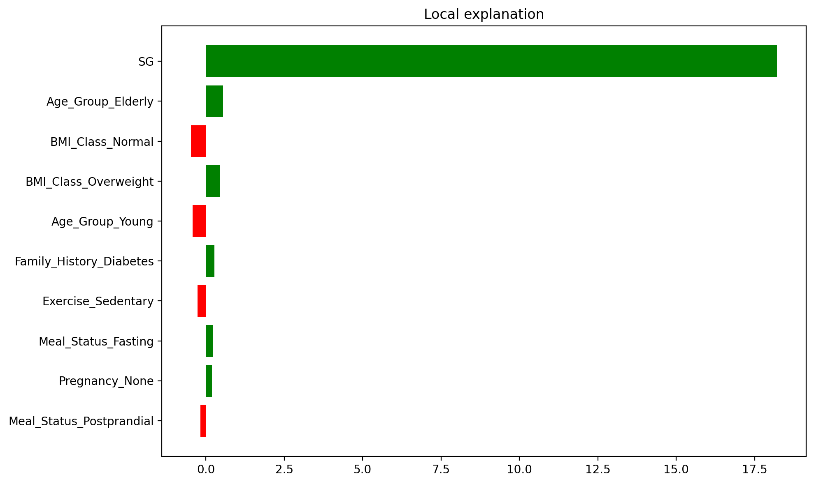

- 개별 샘플에 대한 **국소적(Local) 예측 설명 결과**입니다.
- `SG`의 영향력은 여전히 크지만, LightGBM 대비 **메타 변수 기여도가 상대적으로 불안정**하게 나타납니다.
- 이는 RandomForest 모델에서 **메타 변수의 국소적 기여도가 샘플별로 크게 변동**하며, 이는 **개별 트리 분기 구조 차이에 따른 해석 불안정성**을 시사합니다.


---

### 🔹 Figure 4. SHAP Summary Plot – RandomForest

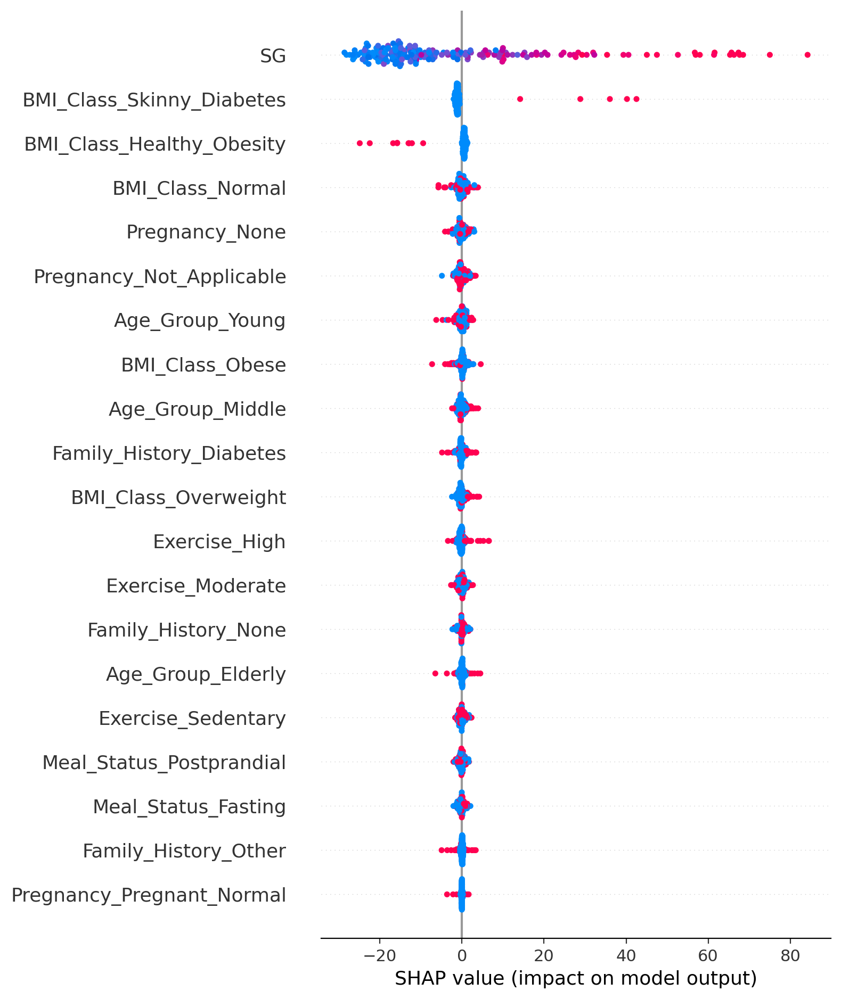

- 전체 데이터셋 기준 **전역(Global) 특성 중요도 분석 결과**입니다.
- `SG`가 여전히 주요 변수이나, 일부 메타 변수의 SHAP 분포가 **넓게 퍼져 있어 해석 안정성이 낮음**을 확인할 수 있습니다.
- 이는 RandomForest가 **다양한 비선형 패턴을 포착**하는 능력은 있으나, **개별 트리의 분기 구조 차이**로 인해 **변수 기여도의 방향성과 크기가 샘플별로 달라져** 전역적으로 일관된 해석을 제공하는 데는 한계가 있음을 시사합니다.


---

### ✅ 설명가능성 분석 종합 요약

> 📌`SG`는 모든 모델에서 **가장 중요한 핵심 변수**이며, **메타 변수는 예측 보정 역할을 수행**합니다.
 
🔹**LightGBM**은 성능뿐 아니라 **설명 안정성 측면에서도 RandomForest 대비 우수**하며, 실제 서비스/임상 적용을 고려할 때 **해석 가능성과 일관성 측면에서 더 적합한 모델**로 판단됩니다.

---
## 📈 교차검증 기반 성능 평가 (K-Fold Validation)

🔹 5-Fold 교차검증을 통해 각 모델의 **일반화 성능과 안정성**을 평가하였습니다.

🔹 각 Fold마다 **R², RMSE, MAE, MARD**를 계산하고, 평균 및 표준편차를 산출하였습니다.

🔹 본 결과는 단일 train/test split이 아닌, **모델의 재현성과 분산 특성**을 평가하는 데 목적이 있습니다.

---

### 🔹 K-Fold 평균 성능 요약 (SG_PLUS_META)

| Model | R² (mean ± std) | RMSE (mg/dL) | MAE (mg/dL) | MARD (%) |
|------|------------------|--------------|-------------|----------|
| Linear | 0.450 ± 0.017 | 26.34 | 20.57 | 22.93 |
| Polynomial | **0.461 ± 0.018** | **26.07** | **20.37** | 22.79 |
| Huber | 0.447 ± 0.017 | 26.42 | 20.48 | **22.44** |
| RandomForest | 0.191 ± 0.038 | 31.95 | 25.21 | 27.76 |
| LightGBM | 0.422 ± 0.015 | 27.02 | 21.25 | 23.77 |

---

### 🔍 K-Fold 결과 해석

🔹 **Polynomial 모델은 가장 높은 평균 R²와 낮은 RMSE/MAE를 기록**하며 전반적인 **예측 정확도 측면에서 가장 우수한 성능**을 보였습니다.

🔹 **Huber 모델은 MARD가 가장 낮아 임상적 상대 오차 관점에서 안정적인 특성**을 나타냈습니다.

🔹 **Linear / Polynomial / LightGBM 모델은 fold 간 표준편차가 작아** 데이터 분할에 따른 성능 변동이 크지 않은 **안정적인 모델군**으로 판단됩니다.

🔹 **RandomForest 모델은 fold 간 분산이 크고 전반적인 성능이 낮아** 본 실험에서는 **일반화 성능이 제한적**임을 확인하였습니다.

> 📌본 교차검증 결과는 **SG_PLUS_META 실험에서 관찰된 성능 개선이 특정 데이터 분할에 의존하지 않으며 실제 적용 환경에서도 재현 가능성이 높음**을 뒷받침합니다.


---

## ⌨️ CLI 입력 예시 및 예측 결과

🔹본 프로젝트는 **CLI 기반 추론 기능을 제공**하여 사용자가 **직접 값을 입력**하고 `BG` **예측 결과**를 확인할 수 있습니다.

 -  **CLI 실행**
```bash
python inference/cli_predict.py
```
 - **입력 예시**
```text
SG (Salivary Glucose): 10
Meal_Status (Fasting / Postprandial): Postprandial
BMI_Class (Normal / Overweight / Obese / Healthy_Obesity / Skinny_Diabetes): Normal
Age_Group (Young / Middle / Elderly): Middle
Exercise (Sedentary / Moderate / High): High
Family_History (None / Other / Diabetes): None
Pregnancy (Not_Pregnant / Pregnant_Normal / Pregnant_GDM): Not_Pregnant
```
 - **예측 결과 예시**
```text
[Prediction Result]
Predicted BG: 121.89 mg/dL
```

---

## ✨ 프로젝트 특징 요약

🔹 **문제 정의 기반**의 **체계적인 전처리 및 이상치 제거** 전략 설계

🔹 **학습·추론·설명(Explainability) 파이프라인을 분리**한 구조적 아키텍처

🔹 **SHAP / LIME 기반 전역(Global)·국소(Local) 모델 설명 가능성** 분석

🔹 **Docker 기반 실행 환경 구축**을 통한 **실험 재현성 및 배포 용이성 확보**

---

## ✅ 종합 결론

> 📌`SG`는 `BG`예측에 의미 있는 출발점이지만 **임상적으로 신뢰 가능한 수준의 예측을 위해서는 생리·생활 메타데이터와의 결합이 필요**합니다.

🔹 타액 포도당(`SG`)은 혈당(`BG`) 예측을 위한 의미 있는 출발 지표임을 확인하였으나, **단일 생체 신호만으로는 임상적으로 신뢰 가능한 수준의 예측 정확도를 확보하는 데 한계가 있음**을 확인하였습니다.

🔹 본 프로젝트는 `SG`기반 **비침습 혈당 예측의 가능성을 실험적으로 검증**하고 **설명가능성(SHAP, LIME), 임상 평가 지표(MARD, CEGA), 교차검증 기반 안정성 평가를 통합한 재현 가능하고 해석 가능한 머신러닝 시스템을 제시**하였습니다.

🔹 특히, 메타데이터를 결합한 **SG_PLUS_META 실험을 통해 단일 SG 모델 대비 설명력, 예측 안정성 및 임상적 허용 범위(A+B zone) 비율이 개선됨을 확인**하였습니다.

🔹 SG_PLUS_META 실험 결과 **Polynomial 및 Huber 모델이 가장 안정적인 성능**을 보였으며, 특히 **Polynomial 모델은 정확도 측면**에서, **Huber 모델은 상대 오차(MARD) 측면**에서 우수한 특성을 나타냈습니다.

---

## ⏭️ 향후 개발 방향

🔹 본 프로젝트는 `SG`기반 `BG`예측의 실험 결과를 토대로 하며, 향후 아래의 방향으로 **기능 고도화 및 임상적 신뢰도 강화**를 계획합니다.
 - **Gradient Boosting** 기반 고성능 모델 도입(XGBoost, Catboost)
 - 성능이 우수한 모델들을 결합한 **앙상블 모델링 전략** 적용(Weighted Ensenble, Stacking Model)
 - 변수 간 상호작용 분석을 위한 **설명가능성(Explainability) 고도화**(SHAP Interaction Value 분석)
 - 실제 임상 서비스 적용 가능성 판단 지표 확보를 위한 **임상적 평가 고도화**(Surveillance Error Grid 사용)