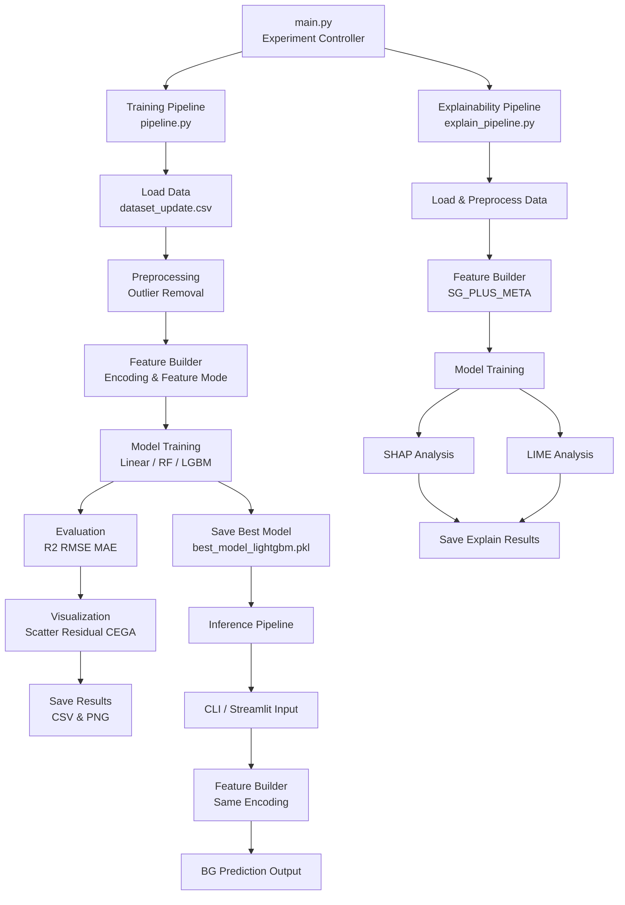

```mermaid
flowchart TD
    A[main.py<br/>Experiment Controller]

    A --> B1[Training Pipeline<br/>pipeline.py]
    A --> B2[Explainability Pipeline<br/>explain_pipeline.py]

    %% Training pipeline
    B1 --> C1[Load Data<br/>dataset_update.csv]
    C1 --> C2[Preprocessing<br/>Outlier Removal]
    C2 --> C3[Feature Builder<br/>Encoding & Feature Mode]
    C3 --> C4[Model Training<br/>Linear / RF / LGBM]
    C4 --> C5[Evaluation<br/>R2 RMSE MAE]
    C5 --> C6[Visualization<br/>Scatter Residual CEGA]
    C6 --> C7[Save Results<br/>CSV & PNG]
    C4 --> C8[Save Best Model<br/>best_model_lightgbm.pkl]

    %% Explain pipeline
    B2 --> D1[Load & Preprocess Data]
    D1 --> D2[Feature Builder<br/>SG_PLUS_META]
    D2 --> D3[Model Training]
    D3 --> D4[SHAP Analysis]
    D3 --> D5[LIME Analysis]
    D4 --> D6[Save Explain Results]
    D5 --> D6

    %% Inference
    C8 --> E1[Inference Pipeline]
    E1 --> E2[CLI / Streamlit Input]
    E2 --> E3[Feature Builder<br/>Same Encoding]
    E3 --> E4[BG Prediction Output]
```