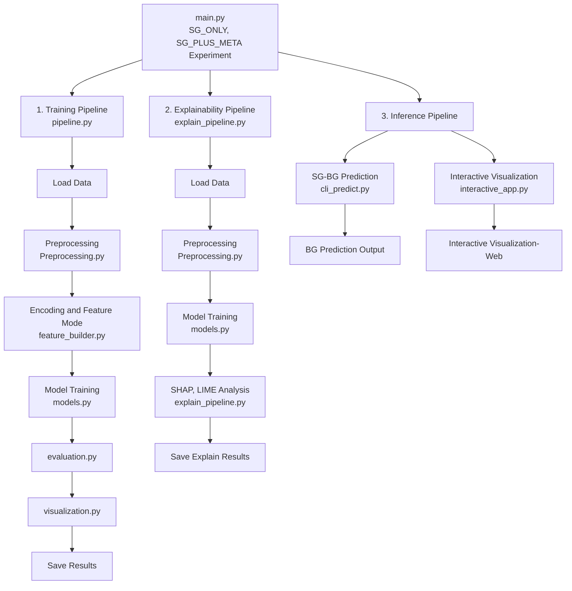

## 🏗 Overall System Architecture

🔹본 프로젝트는 **타액 포도당(SG) → 혈당(BG) 예측**을 위해 **학습(Training) / 설명가능성(Explainability) / 추론(Inference)** 파이프라인을 분리하여 설계된 머신러닝 시스템입니다.

---

## 🔁 전체 시스템 흐름도

---
## 🧩 구성 요소별 설명

### 1️⃣ Experiment Controller (`main.py`)

🔹 **프로젝트의 최상위 실행 진입점**

🔹 실험 조건을 정의하고 파이프라인을 제어

🔹 동일한 코드 구조에서 다음 실험을 반복 수행

- SG_ONLY

- SG_PLUS_META

---

### 2️⃣ 학습 파이프라인 (`pipeline.py`)

🔹**SG → BG 예측을 위한 핵심 학습 파이프라인**으로, 데이터 로드부터 모델 저장까지 전 과정을 자동 수행합니다.

🔹 **주요 단계**
1. 데이터 로드
   - 동일한 원본 데이터셋 사용

2. 전처리
    - 잔차 기반 이상치 제거
    - Isolation Forest 적용

3. Feature Builder
    - 실험 모드에 따라 입력 변수 구성
        - SG_ONLY
        - SG_PLUS_META

4. 모델 학습
    - Linear Regression
    - Polynomial Regression
    - Huber Regression
    - RandomForest
    - LightGBM

5. 성능 평가
    - R², RMSE, MAE, MARD

6. 시각화
    - Scatter
    - Actual vs Predicted
    - Residual
    - Bland–Altman
    - CEGA

7. 결과 저장
    - 예측 결과 CSV
    - 시각화 이미지 PNG

8. 최적 모델 저장
    - SG_PLUS_META 기준 최적 모델을 `.pkl`로 저장

---

### 3️⃣ 설명가능성 파이프라인(`explain_pipeline.py`)

🔹모델 예측 결과를 **사람이 이해 가능한 형태로 해석하기 위한 전용 파이프라인**입니다.

🔹 **설계 특징**
 - 학습/추론 파이프라인과 완전히 분리
 - 성능 안정성 유지 + 해석 정밀도 확보

🔹 **주요 분석 기법**
 - SHAP (Global Explanation)
    - 전체 데이터 기준 feature 중요도
    - 입력 변수들이 예측에 미치는 평균적 영향 분석
- LIME (Local Explanation)
    - 단일 샘플 기반 설명
    - 특정 예측 결과가 나온 이유를 직관적으로 해석

---

### 4️⃣ 추론 파이프라인 (`inference/`, `app/`)

🔹**학습된 모델을 실제 입력값에 적용하는 운영 단계 파이프라인**입니다.

🔹 **구성**
- CLI 기반 추론 (`cli_predict.py`)
- Streamlit 웹 대시보드 (`interactive_app.py`)

🔹 **핵심 설계 원칙**
- 학습 시 사용한 Feature Encoding schema를 동일하게 유지
- 범주형 입력은 문자열 그대로 입력 가능
- 내부에서 자동 인코딩 후 `BG` 예측값 출력

---

## ✅ 아키텍처 설계 핵심 요약

🔹 학습 / 설명가능성 / 추론 파이프라인 분리

🔹 모든 파이프라인에서 동일한 데이터 schema 유지

🔹 임상적 관점의 지표(MARD, CEGA) 포함